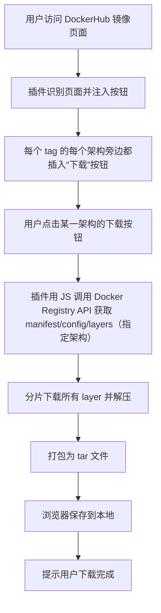

# Chrome 插件：Docker 镜像一键下载器 设计文档

## 一、项目目标

- 在用户访问 DockerHub 镜像页面时，自动识别并在 tag 列表每个架构旁添加“下载”按钮。
- 支持多架构镜像的选择与下载。
- 点击按钮后，直接通过浏览器下载镜像（tar 格式），无需本地 Docker 环境。
- 前端全部用 JavaScript/TypeScript 实现，核心下载逻辑移植自现有 Python 代码。

---

## 二、功能模块

1. **页面识别与按钮注入**
   - 自动检测用户是否在 DockerHub 镜像 tag 列表页面。
   - 在每个 tag 的每个架构旁边插入“下载”按钮。
   - 按钮携带镜像名、tag、架构等信息。

2. **镜像信息解析**
   - 解析页面上的镜像名、tag、可用架构等信息。

3. **镜像下载核心逻辑**
   - 用 JS 实现 Docker Registry API 交互，获取 manifest、layer、config 等。
   - 支持多架构镜像的 manifest list 解析与选择。
   - 支持分片下载、进度显示、合并打包为 tar 文件。

4. **文件保存**
   - 使用浏览器 API（如 FileSystem API 或 a 标签 download 属性）保存 tar 文件到本地。

5. **用户交互与提示**
   - 下载进度条、错误提示、下载完成提示等。

---

## 三、技术选型

- **前端**：TypeScript + 原生 JS（或可选 React/Vue，视复杂度而定）
- **Chrome 插件开发**：Manifest V3
- **网络请求**：fetch/axios
- **打包工具**：webpack/vite
- **辅助库**：pako（gzip 解压）、jsSHA（sha256）、tar-js（打包 tar 文件）

---

## 四、核心流程（已根据用户反馈调整）



### 具体说明

- 插件需监听并解析 DockerHub tag 列表页面的 DOM，找到每个 tag 下的所有架构（如 amd64、arm64 等）。
- 在每个架构旁边插入“下载”按钮，按钮携带镜像名、tag、架构等信息。
- 用户点击后，直接下载对应架构的镜像，无需再弹窗选择。
- 其余流程与原设计一致。

---

## 五、目录结构建议

```
docker-image-chrome-plugin/
├── src/
│   ├── background.ts
│   ├── content-script.ts
│   ├── popup/
│   │   └── popup.html/.ts
│   ├── core/
│   │   ├── docker-download.ts  # 镜像下载核心逻辑
│   │   └── utils.ts
│   └── manifest.json
├── assets/
├── README.md
├── package.json
├── tsconfig.json
└── ...
```

---

## 六、关键技术点与难点

1. **Docker Registry API 兼容性**
   - 需兼容 DockerHub 及其他公开 registry，处理 token 获取、manifest v2、manifest list 等。
   - 需处理多架构镜像的 manifest list 选择。

2. **大文件分片下载与打包**
   - 浏览器端下载大文件需考虑内存与性能，建议分片处理。
   - 需用 JS 实现 gzip 解压与 tar 打包（可用 pako、tar-js 等库）。

3. **页面注入与交互**
   - 需适配 DockerHub 页面结构，防止页面更新导致按钮失效。
   - 需处理 SPA 页面跳转（监听 URL 变化）。

4. **安全与权限**
   - manifest.json 需声明合适的 host 权限。
   - 需处理 CORS 问题（如必要可用 background script 代理）。

---

## 七、备注与代码规范

- **每个核心函数/模块需有详细注释**，说明用途、参数、返回值、异常处理。
- **关键流程需有中文备注**，便于后续维护。
- **README.md** 需包含：
  - 插件功能简介
  - 安装方法（开发者模式加载）
  - 使用说明（如何在 DockerHub 页面下载镜像）
  - 技术实现说明
  - 贡献指南
  - 常见问题与解决方法

---

## 八、README 维护建议

- 每次功能更新需同步更新 README。
- 记录已支持的 registry、已适配的页面结构。
- 说明已知限制（如最大支持镜像大小、浏览器兼容性等）。
- 提供联系方式或 issue 提交方式。

---

## 九、后续可扩展方向

- 支持私有 registry 登录与下载
- 支持批量下载
- 支持镜像信息预览
- 支持导入到本地 Docker

---

> 本文档为项目开发与维护的基础文档，后续如有需求变更请及时同步更新。 